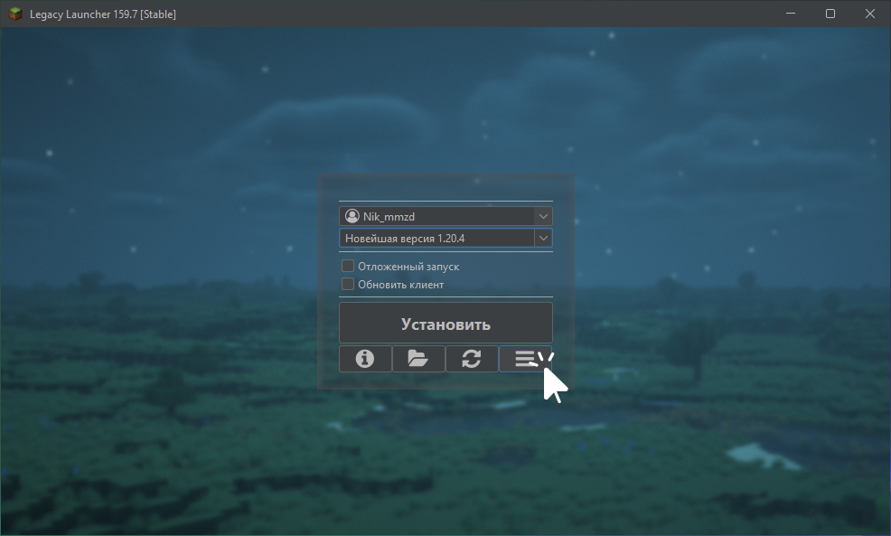
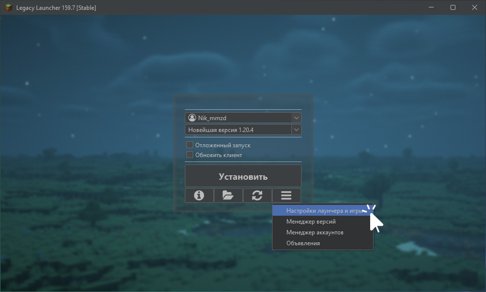

# Настройки лаунчера
## Как открыть настройки лаунчера? {#accessing}
1. Нажмите кнопку "Дополнительно"
    
2. Выберите пункт "Настройки лаунчера и игры"
    

## Описание настроек {#description}
### Вкладка "Minecraft" {#minecraft}
* **Директория**: путь к папке с данными игры
    * Можно выбрать один из режимов [**подпапок по версиям**](./subfolders)
* **Разрешение**: размер окна игры при запуске
    :::note
    Данная настройка не влияет на разрешение полноэкранного режима
    :::
* **Полноэкранный режим**: запускать игру в полноэкранном режиме
* **Список версий**: позволяет выбрать отображаемые версии
    * **Загружать сервера**: загружать список доступных версий из репозиториев
    * **Модификации**: показывать модифицированные версии (с Forge, Fabric, OptiFine...)
    * **Альфа**: показывать альфа-версии игры (выпущенные до 2010 года)
    * **Бета**: показывать бета-версии игры (выпущенные в 2010-2011 году)
    * **Релизы до 1.7.10**: показывать версии, выпущенные ранее версии 1.8
    * **Снапшоты**: показывать предварительные версии игры
    * **Экспериментальные**: показывать экспериментальные версии (например, `combat test`)
    * **Лаунчеры**: показывать другие лаунчеры
        :::note
        В данный момент подобных версий в лаунчере нет
        :::
    * **Только установленные**: скрыть неустановленные версии из главного меню
        :::tip
        Установить версии всегда можно через "менеджер версий" (кнопка "дополнительно")
        :::
* **Java/JRE**: выбрать используемую версию Java для запуска игры
    * **Рекомендуемая**: лаунчер автоматически скачает и использует *рекомендуемую Mojang* версию Java
        :::tip
        Вы можете [заменить](../faq/custom-java) рекомендуемые версии Java на желаемые
        :::
    * **Только текущая**: лаунчер будет запускать игру на той же версии Java, что использовалась для запуска лаунчера
    * **Пользовательская**: задать путь к пользовательскому файлу `bin/java` или `javaw.exe` JRE
* **Память (ОЗУ)**: позволяет выбрать количество выделенной для Minecraft оперативной памяти
    :::tip
    Вы можете ввести *произвольное* значение в текстовое поле справа от слайдера
    :::
    * **Авто**: лаунчер будет автоматически выбирать объем выделенной ОЗУ
* **Видеокарта**: выбор видеокарты для запуска Minecraft
    :::note
    Этот параметр показывается только на совместимых системах
    :::
    * **Использовать системные настройки**: будут использоваться стандартные параметры запуска приложений
    * **Использовать встроенную видеокарту**: будет использоваться встроенная в процессор видеокарта
        :::tip
        Использование встроенной видеокарты зачастую приведет к значительному падению производительности игры, но позволит сэкономить заряд аккумулятора ноутбука
        :::
    * **Использовать дискретную видеокарту**: будет использоваться дискретная (высокопроизводительная) видеокарта
* **Скины Ely.by**: использовать скины Ely.by при запуске игры
    :::note
    На данный момент эта опция работает только для аккаунтов "без пароля"
    :::
    :::info
    Эта настройка будет перенесена в "Менеджер аккаунтов" в версии 161.0
    :::
* **Автодобавление серверов**: разрешает лаунчеру добавлять рекомендованные сервера во внутриигровое меню "сетевой игры"
* **Использовать GameMode**: применять оптимизации [GameMode](https://github.com/FeralInteractive/gamemode) при запуске игры
    :::note
    Этот параметр показывается только на совместимых системах
    :::

### Вкладка "Лаунчер" {#launcher}
* **Размер окна**: размер окна лаунчера
* **Размер шрифта**: размер шрифта в лаунчере
    :::warning
    Мы не рекомендуем использовать эту опцию. Эта опция будет удалена в версии 161.0.
    :::
* **Форма входа**: положение формы входа в главном меню лаунчера
* **Тема лаунчера**: выбор темы лаунчера
    * **Темная**, **Светлая**: выбор соответствующей темы оформления
    * **Определять автоматически**: автовыбор светлой или темной темы в зависимости от текущих настроек операционной системы
    * **Использовать системный L&F**: Использовать стандартный дизайн Java-приложений для вашей ОС
    * **Не изменять L&F**: Не применять дизайн приложения
* **Фон**: задает путь к фоновому изображению лаунчера в форматах `jpg` и `png`
    :::tip
    Если вы запускаете лаунчер на JRE с поддержкой JavaFX, лаунчер позволит установить на фон mp4-видео
    :::
* **Журнал событий**: включает отображение окна с журналом событий (логом лаунчера и игры)
* **Полная команда**: скрывать маловажную часть команды запуска игры
* **При запуске Minecraft**: выбрать действие при запуске Minecraft
    * **Скрывать Legacy Launcher**: скрыть окно лаунчера. Окно лаунчера откроется после закрытия игры
    * **Закрывать Legacy Launcher**: закрывать лаунчер после запуска игры. Анализатор крашей и журнал событий перестанут работать
    * **Ничего не делать**: окно лаунчера останется открытым после запуска игры
        :::danger
        Мы не рекомендуем использовать эту настройку с целью запуска нескольких клиентов игры из одного экземпляра лаунчера
        :::
* **Анализ ошибок**: включает **модуль анализа краша**, который будет пытаться подсказать решение самых распространенных проблем
* **Оповещать о новых**: при запуске, лаунчер будет показывать сообщение со списком вышедших (или обновленных) с момента закрытия лаунчера **релизов**, **снапшотах** и **модифицированных версий**
* **Объявления**: показывать объявления под формой входа
    :::tip
    Для отключения полноэкранного (развернутого) списка серверов закройте список серверов кнопкой "дополнительно"
    :::
* **Бета-версия**: разрешает обновление лаунчера до последней *бета-версии*
* **Язык**: выбор языка интерфейса лаунчера

### Меню "Java/JRE" {#java}
* **Выбор Java**: выбрать используемую версию Java для запуска игры
    :::tip
    Эта опция идентична настройке на вкладке "Minecraft"
    :::
* **Путь**: путь к используемой в данный момент Jre
* **Аргументы Java**: аргументы для JVM (Java), например, `-Xmx` или `-Xms`
* **Оптимизированные аргументы**: дополнительно к указанным **аргументам Java** добавить встроенные в лаунчер наборы аргументов, оптимизирующих работу Java (и, как следствие, игры)
    :::info
    При невозможности использования выбранного сборщика мусора будут применяться настройки **по умолчанию**
    :::
    * **Отключить** - лаунчер не будет изменять настройки Java. Не рекомендуется, за исключением случаев, когда вы хотите указать свой набор параметров.
    * **По умолчанию** - будет использовать CMS на старых версиях Java и G1 GC на новых. Опция аналогична галочке "оптимизированные аргументы" в более старых версиях лаунчера. G1 будет применяться на мощных ПК для Java 8 или новее, или на всех ПК для Java 11 или новее, в остальных случаях будет использоваться CMS.
    * **Использовать G1 GC** - использовать [G1 GC](https://www.oracle.com/technetwork/tutorials/tutorials-1876574.html) во всех возможных случаях. Требования: Java 8 или новее.
    * **Использовать Shenandoah GC** - использовать [Shenandoah GC](https://wiki.openjdk.org/display/shenandoah/Main) во всех возможных случаях. Требования: Java 11.0.9 или новее.
        :::note
        Использование Shenandoah GC может уменьшить микролаги при очистке мусора. Рекомедуется при большом количестве выделенной ОЗУ. Полезным дополнением может оказаться эксперимент `tenuring`
        :::
    * **Использовать ZGC** - использовать [ZGC](https://wiki.openjdk.org/display/zgc) во всех возможных случаях. Требования: Java 15 или новее; Windows 10 build 17134 или новее, или macOS/Linux.
        :::info
        ZGC заявляется как "революционный" сборщик мусора, не допускающий пауз более чем на 1 миллисекунду. Теоретически, он должен лучше всего подходить для Minecraft
        :::
        :::warning
        При использовании ZGC может создаваться иллюзия перерасхода оперативной памяти игрой. Кроме того, возможны подлаги первые несколько минут игры
        :::
* **Аргументы Minecraft**: аргументы для Minecraft, например, `--server` или `--fullscreen`
    :::tip[Как понять, куда вписывать аргумент?]
    Аргументы для JVM обычно начинаются с **одного** дефиса.  
    Аргументы для Minecraft обычно начинаются с **двух** дефисов.
    :::
* **Команда-обёртка**: команда, использующаяся как "обертка" для запуска игры, например, MangoHUD или Gamemode