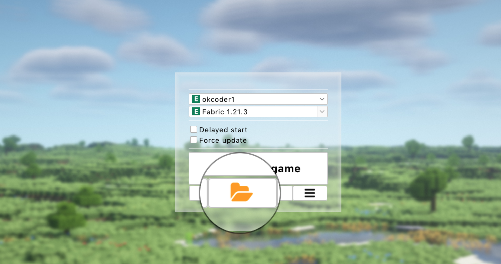
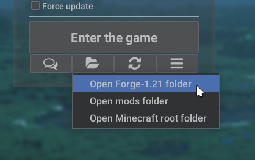
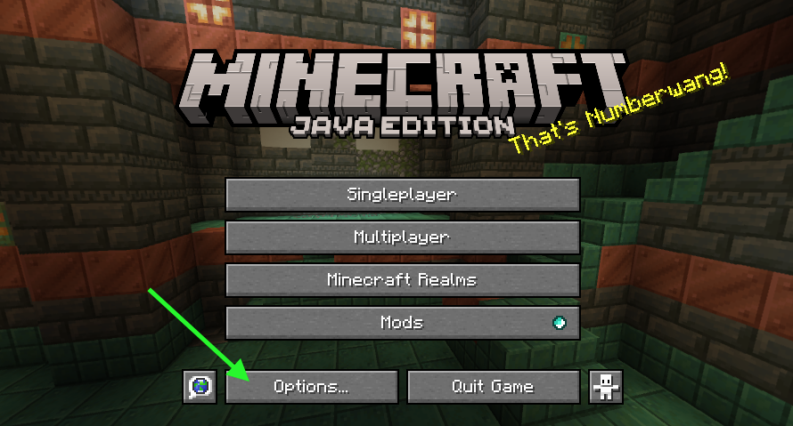
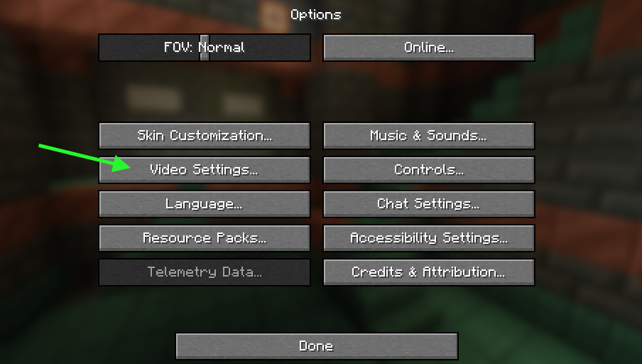
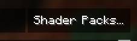
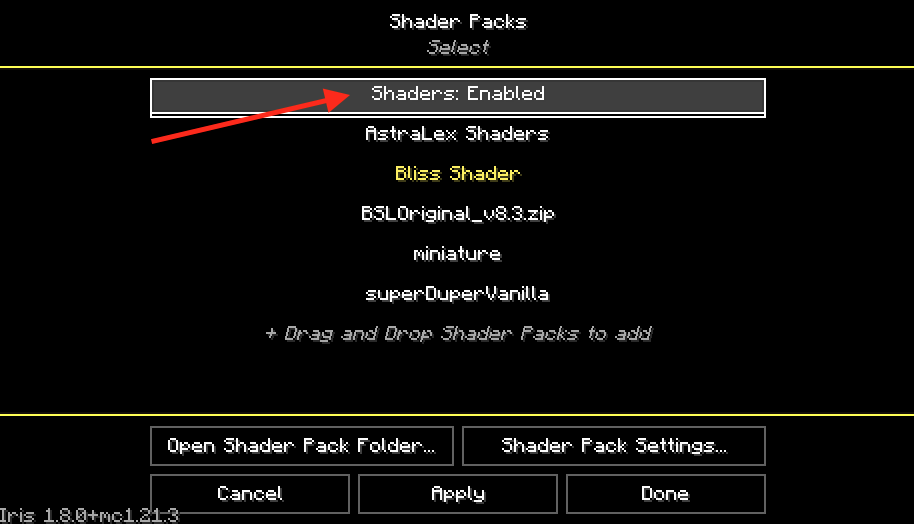
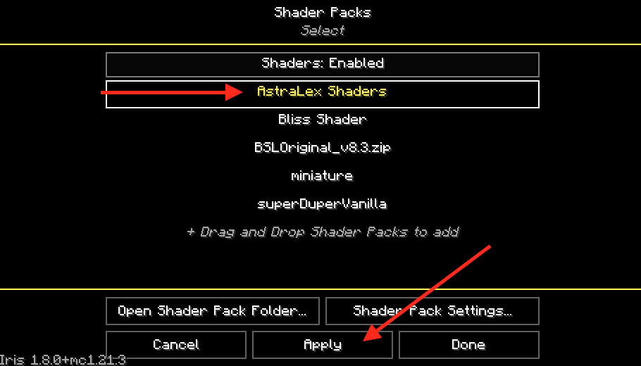
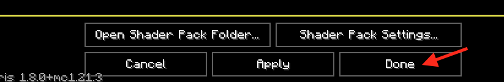

# Shaderpacks installation

:::note
Shaderpacks might be referred to as shaders in the following guide.
:::

1. Install selected [shader mod](./optifine-alternatives.md#shaders) or [OptiFine](../mods/optifine.md). You may need a [modloader](/tags/modloader).
   :::warning
   OptiFine is a highly unstable mod. We do not recommend using it with other mods. Try [alternatives](./optifine-alternatives.md#shaders) instead.
   :::
2. Run Minecraft
   :::note
   This will create a new folder called `shaderpacks` in the Minecraft game directory.
   :::
3. Download shaders from websites such as [Modrinth](https://modrinth.com/shaders) or [CurseForge](https://www.curseforge.com/minecraft/search?class=shaders).
4. Move the downloaded shaders to the new `shaderpacks` folder in the Minecraft game directory.
   :::info[Opening the Minecraft game directory]
   i. Click on the folder icon in Legacy Launcher.
      
   ii. Click on `Open version-name directory`.
   
      
   :::
   :::tip
   Some shader mods allow you to "drag" a new shaderpack to `Shader Packs` in-game menu instead.
   :::
6. Run Minecraft (if closed) and click on `Options`
   
7. Click `Video Settings`
   
   :::note
   After installing most shader mods, there will be a new `Video Settings` layout. This confirms that the shader mod is working.
   :::
8. Click on the new `Shader Packs` button.
   
   
10. Click on `Shaders: Disabled` to enable shaders. (Ignore if already enabled)
    
11. Click on the shader you want to enable (in this case `AstraLex Shaders`) and click on `Apply`.
    
    :::note
    This will make the selected shader highlighted in yellow.
    :::
12. Click on `Done`.
    
    
