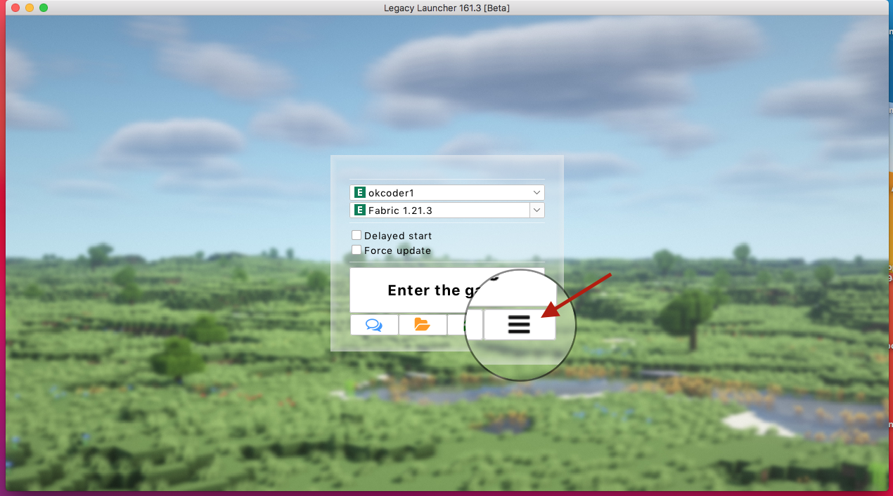
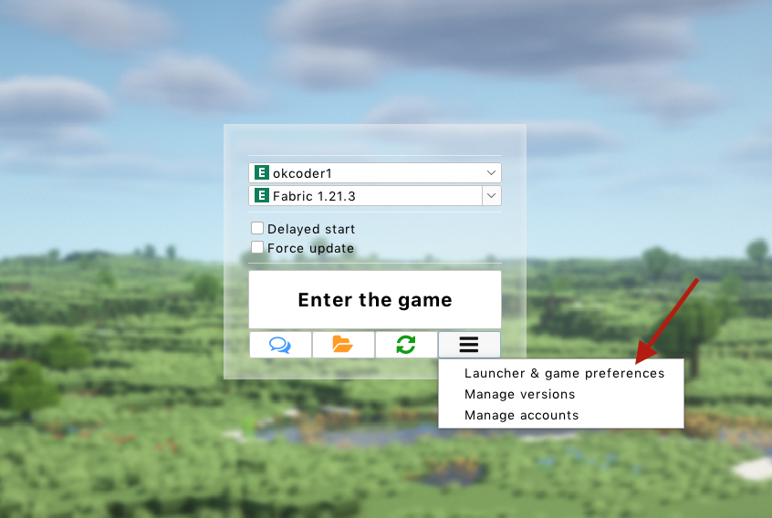

# Launcher preferences

## How do I access the launcher preferences? {#accessing}
1. Click the "Preferences" button (one with three stripes)
    
2. Select the "Launcher & game preferences" item
    

## Preferences description {#description}
### "Minecraft" tab {#minecraft}
* **Directory**: game data folder path
    * You can enable [**Subfolders feature**](./subfolders.md)
* **Resolution**: game window size at startup
    :::note
    This setting does not affect the fullscreen resolution
    :::
* **Fullscreen**: force fullscreen mode for the game
* **Version list**: selects displayed Minecraft versions
    * **Remote from server**: download a list of available versions from online sources
    * **Modified**: Show modified game versions (with pre-installed Forge, Fabric, OptiFine...)
    * **Alpha**: Show Minecraft Alpha (released about 2010)
    * **Beta**: Show Minecraft Beta (released in 2010-2011)
    * **Show old releases**: Show releases before 1.8
    * **Snapshots**: Show snapshots (unstable, preview game versions)
    * **Experimental**: Show experimental snapshots (e.g. `combat test`)
    * **Launchers**: Show other launchers
        :::note
        There is no such versions now, this setting is obsolete
        :::
    * **Only installed**: Hide non-installed Minecraft versions
        :::tip
        When enabled, new versions should be installed using "Manage versions" menu (accessed with "Preferences" button)
        :::
* **Java/JRE**: select the Java version used to launch the game
    * **Recommended**: Launcher will automatically download and use the *Mojang recommended* Java version
        :::tip
        You can [customize](../faq/custom-java.md) these versions
        :::
    * **Current only**: Launcher will use the same Java executable used for starting the launcher
    * **Custom**: Select custom java by providing a path to `bin/java` or `javaw.exe` JRE executable
* **Memory (RAM)**: select the amount of RAM allocated to Minecraft
    :::tip
    You can enter *any* value in the text box to the right of the slider
    :::
    * **Auto**: allows the launcher to change the amount of allocated RAM on its own
* **GPU**: Select GPU used to run Minecraft
    :::note
    This option is only shown on compatible systems
    :::
    * **Use system settings**: system settings will be used
    * **Use integrated GPU**: launcher will force integrated GPU to be used
        :::tip
        Using an integrated graphics card will often result in a significant drop in game performance, but will save laptop battery and reduce device heating
        :::
    * **Use discrete GPU**: launcher will force dedicated (high-performance) GPU to be used
* **Ely.by skins**: use Ely.by skins in the game
    :::note
    This option is respected only for "w/o password" accounts
    :::
    :::info
    This option will be moved to "Manage accounts" menu in 161.0
    :::
* **Suggest servers**: allows the launcher to add recommended servers to the in-game "Multiplayer" menu
    :::note
    There are no suggested servers for non-RU/non-CIS countries
    :::
* **Use GameMode**: enable [GameMode](https://github.com/FeralInteractive/gamemode) optimizations on game launch
    :::note
    This option is only shown on compatible systems
    :::

### "Launcher" tab {#launcher}
* **Window size**: launcher window size
* **Font size**: launcher font size
    :::warning
    We do not recommend using this option. This option will be removed in 161.0
    :::
* **Main form location**: main (login) form position
* **Look and Feel**: theme selector
    * **Dark**, **Light**: select basic dark or light theme
    * **Auto**: automatically select theme based on system settings
    * **Use system L&F**: use Java default L&F
    * **Don't change L&F**: disable any theming
* **Background**: set custom background image. Supported image formats are `jpg` and `png`
    :::tip
    If you're using a JRE with built-in JavaFX the launcher will allow you to set a mp4 video as background
    :::
* **Logger**: enables debug logger (with launcher and game debug messages)
* **Full command**: when disabled hides non-essential Minecraft launch arguments in logger messages
* **After starting Minecraft**: select launcher action to be executed after starting the game
    * **Hide Legacy Launcher**: hide launcher window and open it back when the game is closed
    * **Close Legacy Launcher**: fully close the launcher. Logger and Crash Manager will not be able to function
    * **Do nothing**: do nothing, launcher window will stay open
        :::danger
        We do not recommend using this option for the purpose of running multiple game clients from a single instance of the launcher
        :::
* **Crash Manager**: enables **crash analyler** that will suggest possible solutions to the most common problems
* **Alert on new**: launcher will display a message with a list of **releases**, **snapshots** and **modified versions** that have been released (or updated) since the launcher was closed.
* **Notices**: show ads and announcements under the login form
* **Beta branch**: allows upgrading the launcher to the latest *beta version*
* **Language**: selecting the interface language used in the launcher. Does not affect the game

### "Java/JRE" menu {#java}
* **Select Java**: select the Java version used to launch the game
    :::tip
    This option is identical to the setting located on "Minecraft" tab
    :::
* **Java settings**
    * **Path**: path to used Java executable
    * **Java arguments**: JVM (Java) arguments, e.g. `-Xmx` or `-Xms`
    * **Optimized arguments**: in addition to specified **Java arguments** adds built-in Java optimization arguments
        :::info
        If selected GC does not meet usage requirements, **default** settings will be used
        :::
        * **Disable** - disables this feature. Not recommended unless you're using custom Minecraft arguments set.
        * **Default** - will use G1 GC when applicable and fall back to CMS. G1 will be used for powerful PCs for Java 8 and newer, and for all PCs for Java 11 and newer. Identical to an old "Optimized arguments" checkbox.
        * **Force G1 GC** - forces G1 GC to be used when possible. Requires Java 8 or newer.
        * **Force Shenandoah GC** - forces Shenandoah GC to be used when possible. Requires Java 11.0.9 or newer.
            :::note
            Shenandoah GC may reduce game stuttering when running GC. Large RAM allocation recommended. `tenuring` experiment may improve performance even more
            :::
        * **Force ZGC** - forces ZGC to be used when possible. Requires Java 15 or newer and Windows 10 build 17134 or macOS/Linux.
            :::info
            ZGC claims to be a "revolutionary" garbage collector and does not allow stutters more that 1ms long. In theory it should be the best GC for running Minecraft
            :::
            :::warning
            ZGC may cause wrong used RAM calculations in Task Manager. Also, some stuttering may occur for the first minutes of playing
            :::
    * **Minecraft arguments**: Minecraft arguments, e.g. `--server` or `--fullscreen`
        :::tip[How do you figure out where to put the argument?]
        JVM arguments usually start with **one** hyphen.  
        Minecraft arguments usually start with **two** hyphens.
        :::
    * **Wrapper command**: command used to "wrap" Minecraft. Useful for tools like MangoHUD or Gamemode
